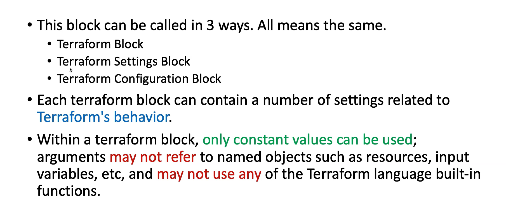
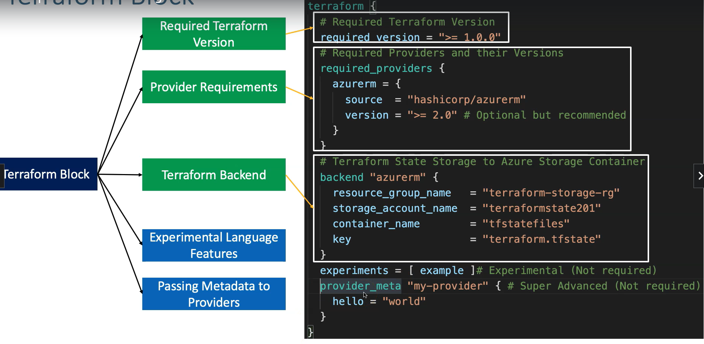
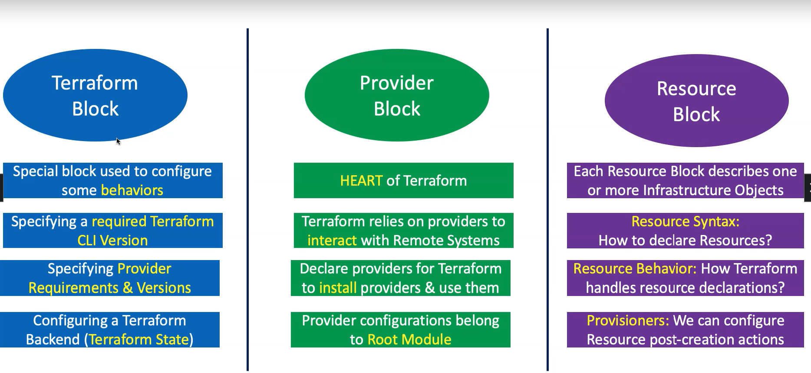
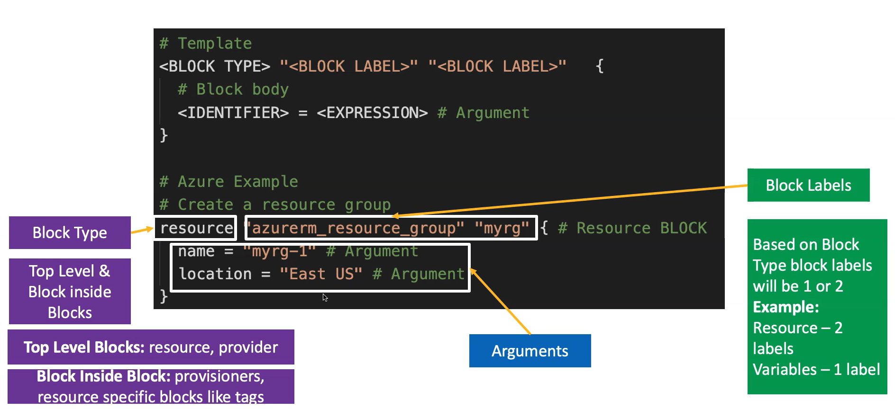
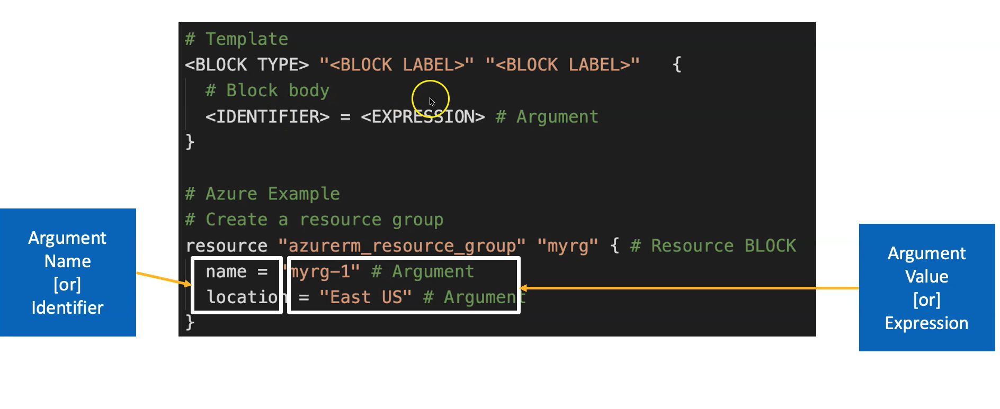

---
tags:
    - tfbasics
    - files
---

# Terraform Language Basics

## Files
``` extensions ```   
- code in terraform language is stored in plain text files with the ``` .tf ``` file extension.
- there is a JSON-based variant of the language that is named with the ``` .tf.json ``` file extension.
- we can call the files containing terraform code as **Teraform Configuration Files** or **Terraform Manifests**.
- we will use terraform commands inside the working directory that lists the ``` .tf ``` files.

## Configuration Syntax
``` HCL - HashiCorp Language ```   
### Terraform
- Blocks    
#### Fundamental Blocks      
- Terraform Block 





- Providers Block   
- Resources Block   



#### Variable Blocks  
- Input Veriables Block   
- Output Values Block   
- Local Values Block    

####  Calling/Referencing Blocks   
- Data Sources Block
- Modules Block

- Arguments   
these are the arguments that need to be referenced for a resource. 2 types optional & required.
- Identifiers
- Comments




- Attributes References   
these are arguments that are generated after a resource is created.
- Meta-Arguments    
they help us in achieving certain requirements within the resource block.

